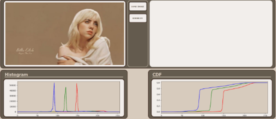
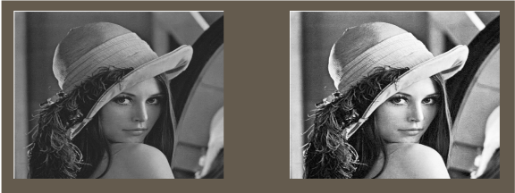
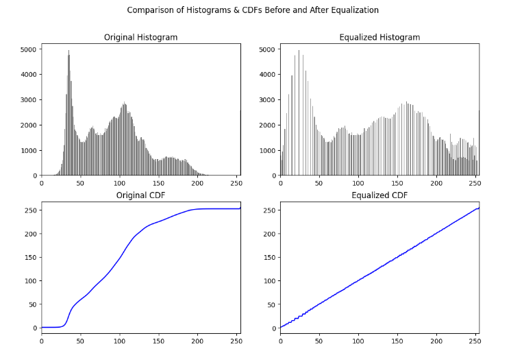
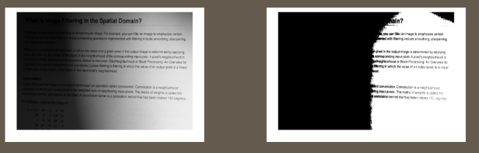
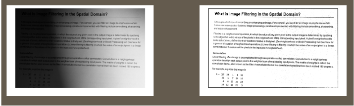
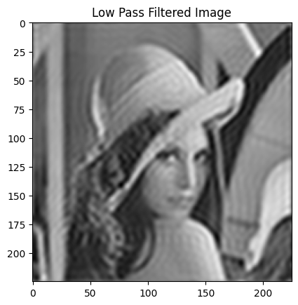
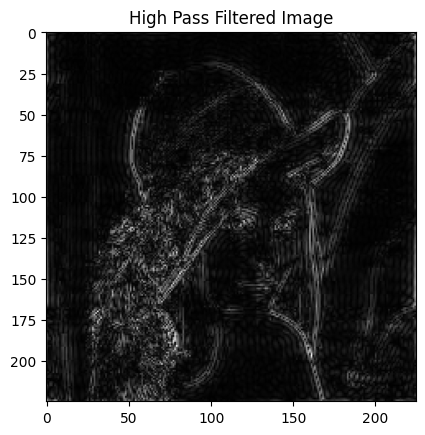
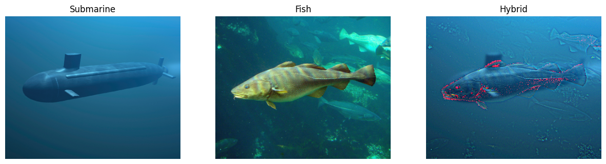

# Image Processing Toolkit

A desktop application built using PyQt5 and OpenCV to perform essential image processing techniques such as noise manipulation, filtering, edge detection, histogram analysis, equalization, normalization, thresholding, grayscale conversion, frequency domain filtering, and hybrid image construction.

---

## Features

1. Load, display, and reset images.  

2. Add noise to images:
   - Gaussian
   - Salt & Pepper
   - Uniform

3. Apply noise filtering techniques:
   - Mean filter
   - Median filter
   - Gaussian filter  

4. Detect edges using:
   - Sobel operator
   - Prewitt operator
   - Canny edge detection  

5. Plot histograms and cumulative distribution functions (CDFs) for grayscale and RGB channels.  
   

6. Perform histogram equalization for contrast enhancement.  
   

   

7. Normalize image intensities using min-max normalization.

8. Apply thresholding techniques:
   - Global thresholding
     
   

   - Adaptive (local) thresholding
    
   

9. Convert RGB images to grayscale using perceptual weighting.

10. Apply frequency domain filtering using Fourier transforms and adjustable masks.  

    ### Original
    
    .png)

    

    

12. Create hybrid images by combining low-pass and high-pass features from two images.  
    

---

## Getting Started

Follow these steps to set up and run the project on your local machine.

### 1. Clone the repository

```bash
git clone https://github.com/MohamedHisham20/CV_filter_and_edge_detection.git
```

### 2. Install requirments

```bash
pip install -r requirements.txt
```

### 3. Run the application

```bash
python main.py
```

## Contributors

<table>
  <tr>
    <td align="center">
      <a href="https://github.com/bassantrabie">
        <br />
        <sub><b>Bassant Rabie</b></sub>
      </a>
    </td>
    <td align="center">
      <a href="https://github.com/yasmine-msg79">
        <br />
        <sub><b>Yasmine Gaballa</b></sub>
      </a>
    </td>
    <td align="center">
      <a href="https://github.com/Ibrahim-Fateen">
        <br />
        <sub><b>Ibrahim Fateen</b></sub>
      </a>
    </td>
    <td align="center">
      <a href="https://github.com/MohamedHisham20">
        <br />
        <sub><b>Mohamed Hisham</b></sub>
      </a>
    </td>
  </tr>
</table>
